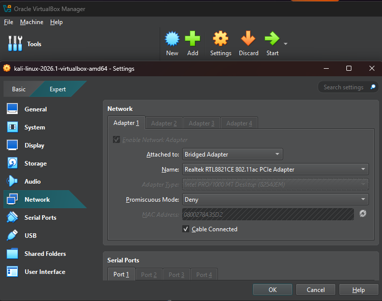
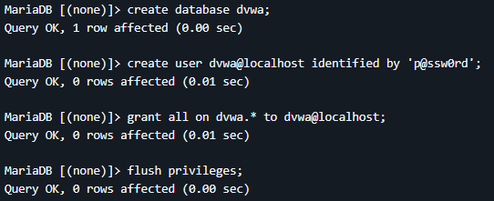
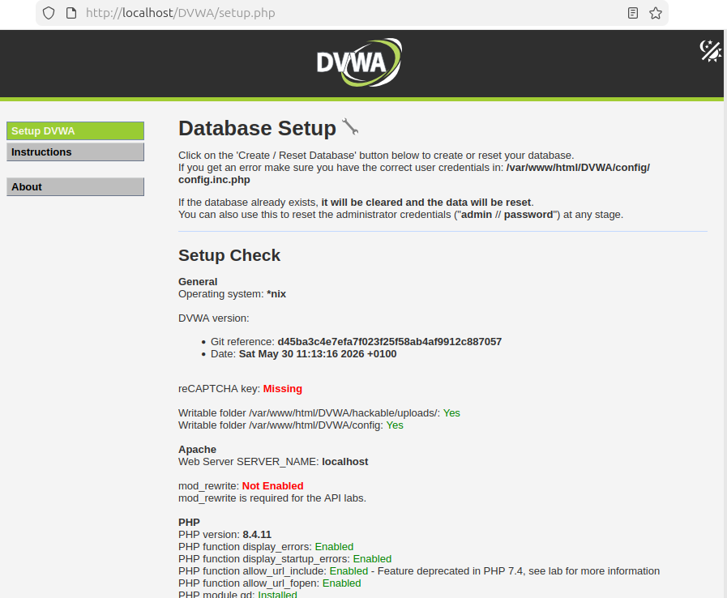
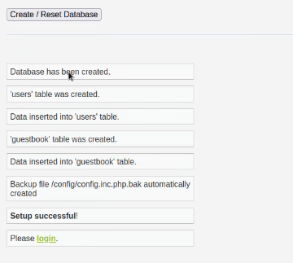
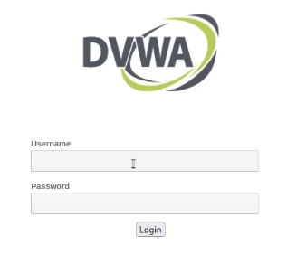
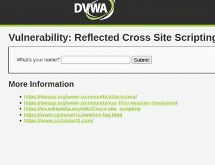

# Web Application Firewall Home Lab

## Introduction

In this lab, we will build a complete cybersecurity home lab using virtual machines. The goal is to first set up a vulnerable web application (DVWA) on Ubuntu. Demonstrate how to perform a basic SQL injection attack from Kali Linux then use the web application firewall (WAF) to protect against such attacks. Finally explore additional WAF security measures such as HTTP flood defense and custom deny rules. This lab assumes you have basic Linux command line knowledge.

## Prerequisites

* Host Machine

(at least 8 GB RAM and 50 GB disk space)

* Internet Connection

(for downloading software and updates)

## Lab Environment Setup

### Download and Install VirtualBox

Go to the official VirtualBox download page: https://www.virtualbox.org/wiki/Downloads and select the version for your host OS. Run the downloaded installer and follow the on-screen instructions.

### Create the Kali Linux Virtual Machine

1. Go to the official Kali Linux download site: https://www.kali.org/get-kali and select virtual machines to get sent to the page with pre-built inages. Select VirtualBox.

2. Attach the Kali ISO & Install:

* Go to Machine > Add, select the Kali virtual disk image you downloaded (you may have to decompress the file first).

* Start the VM, it should bring you straight to the login screen. The login is kali/kali by default.


### Create the Ubuntu Server Virtual Machine

1. Download Ubuntu from the official site: https://ubuntu.com/download/desktop and choose the latest LTS release.

2. Create a New VM in VirtualBox, start the VM and follow the Ubuntu Server installation instructions. Create a username/password (e.g., ubuntu / ubuntu).

* Name: UbuntuServer

* Type: Linux

* Version: Ubuntu (64-bit)

* Memory: At least 2 GB (2048 MB)

* Hard Disk: ~20 GB (dynamically allocated)

### Enable Bridged Networking

1. Open VirtualBox > select your VM (e.g., UbuntuServer) > Settings > Network.

2. Adapter 1: Choose Bridged Adapter from the “Attached to” drop-down.

3. Select your host’s network interface (Ethernet or Wi-Fi) then click OK.

4. Repeat for second VM.



## DVWA Installation

1. You will need to install the packages listed below then restart apache2.

* apache2

* libapache2-mod-php

* mariadb-server

* mariadb-client

* php php-mysqli

* php-gd

`apt install -y apache2 mariadb-server mariadb-client php php-mysqli php-gd libapache2-mod-php`

`sudo systemctl restart apache2`

2. Configurations

DVWA ships with a dummy copy of its config file which you will need to copy into place and then make the appropriate changes. From the DVWA directory `cp config/config.inc.php.dist config/config.inc.php`. The contents of the file should look like this:

```
$_DVWA[ 'db_server'] = '127.0.0.1';

$_DVWA[ 'db_port'] = '3306';

$_DVWA[ 'db_user' ] = 'dvwa';

$_DVWA[ 'db_password' ] = 'p@ssw0rd';

$_DVWA[ 'db_database' ] = 'dvwa';
```

3. Database Setup

Jump to root and create a new database user.

`sudo su -`

`mysql` (odd but keep going)

You should be in a MariaDB CLI now but not yet connected to database.

`create database dvwa;`

`create user dvwa@localhost identified by 'p@ssw0rd';` The User and Password must match the config.inc.php file from above.

`grant all on dvwa.* to dvwa@localhost;`

`flush privileges;` Tells database to reload authentication privileges.



You can check if you properly configured things by using `mysql -u root -p` then entering the password. If done properly you should have no trouble logging in from a separate terminal. Alternatively you can do `mysql -u root -ppassword` with no spaces between the tag and the password. 

4. DVWA Webpage

Navigate to `localhost/DVWA/setup.php` in your browser and click `Create/Reset Database`. You should be redirected to the login page. The default credentials are admin/password.








Now to give it a test to make sure it works lets try a reflected XSS attack. Navigate to XSS (Reflected) on the DVWA webpage. It will ask you for your name. Place any alphanumeric string in the box as well as `<script> alert() </script>` then click submit. The browser should trigger a popup.




----------------------------

## Install and Configure Web Application Firewall

Coming Soon
